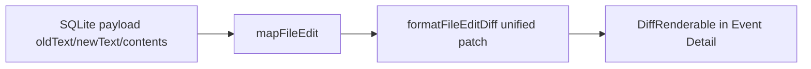

# File-edit event details as code diffs

## Diagnosis

End-to-end against the live index (`~/.ag-explorer/index.sqlite`), `file_edit` payloads already carry `oldText` / `newText` / `contents`, and [`formatEventDetailPlain`](src/ui/event-detail.ts) produces Path/Kind plus ad-hoc `  -` / `  +` lines. That is not a real unified patch and does not use OpenTUI’s diff view.

So today EDIT details either look like sparse metadata (Path/Kind only when bodies are empty) or plain unstyled lines that do not read as a code diff. OpenTUI’s [`DiffRenderable`](node_modules/@opentui/core/index.bun.js) expects a parseable unified patch; invalid/empty patches build **no children** (literally blank).

## Approach

**1. Build a real unified diff in [`src/ui/event-detail.ts`](src/ui/event-detail.ts)**

- Add `formatFileEditUnifiedDiff(event: FileEditEvent): string | null` using a small hand-rolled patch (no new dependency):
  - `str_replace`: `---` / `+++` path headers + one hunk of `-old` / `+new` lines
  - `write`: `/dev/null` → path, all `+` lines (keep existing preview cap, e.g. first 20 lines + notice)
  - `delete` or missing bodies: return `null`
- Update `formatEventDetailPlain` for `file_edit` to:
  - Always show Path / Kind
  - Append the unified diff when present
  - Otherwise append an explicit notice: `Edit contents not recorded in transcript.` (instead of Path/Kind alone)
- Keep this string as the source of truth for copy/export ([`src/core/export.ts`](src/core/export.ts)).

**2. Render EDIT details with `DiffRenderable` in [`src/ui/app.ts`](src/ui/app.ts)**

- Import `DiffRenderable` from `@opentui/core`.
- In the Event Detail pane, when expanded on `file_edit` with a non-null patch: show a short header Text (Path / Kind) plus a `DiffRenderable` (`view: "unified"`, `diff: patch`, themed add/remove colors from [`src/ui/theme.ts`](src/ui/theme.ts)).
- For all other events (and EDIT with no patch): keep the existing `TextRenderable` path.
- Swap/show the appropriate child inside `detailScroll` from `renderDetail` so non-edit events stay unchanged.
- Harden layout: give detail content `width: "100%"` and `flexShrink: 0` so multi-line bodies measure reliably inside `ScrollBox`.

**3. Harden mapping fallbacks in [`src/providers/cursor/project.ts`](src/providers/cursor/project.ts)**

In `mapFileEdit`, resolve fields with input fallbacks:

- `oldText` ← `p.oldText` ?? `input.old_string`
- `newText` ← `p.newText` ?? `input.new_string`
- `contents` ← `p.contents` ?? `input.contents`

(Defensive; live index already has top-level fields.)

**4. Tests**

- [`test/ui/event-detail.test.ts`](test/ui/event-detail.test.ts): StrReplace produces parseable `---`/`+++`/`@@`/`-`/`+` lines; Write shows additions; missing bodies show the explicit notice; delete stays path-only.
- [`test/providers/cursor/project.test.ts`](test/providers/cursor/project.test.ts): mapping falls back to `input.old_string` / `input.new_string` when top-level fields are absent.

## Out of scope

- Re-indexing (payloads already correct for nearly all EDIT events)
- Changing timeline labels or category filters
