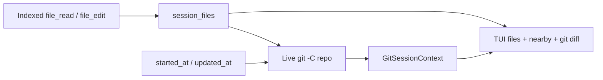

# v0.6 — Git-Aware Sessions

## Context

Today AGExplorer knows **which files a session read/edited** (timeline `READ`/`EDIT` from Cursor tools) but not **which Git repo, branch, or commits** sit next to that work. Projects are Cursor workspace folders ([`src/providers/cursor/discover.ts`](src/providers/cursor/discover.ts)), not Git roots. Session time is file birth/mtime ([`parseSessionFile`](src/providers/cursor/parse.ts)), and event `timestamp` is always `null`. File-edit **transcript** diffs already render in Event Detail via `DiffRenderable` ([`src/ui/app.ts`](src/ui/app.ts)).

This milestone adds a first-class **session → files** graph plus **heuristic Git context** labeled **Nearby commits** (never “produced by”).



## Locked decisions

- **session_files** are derived from transcript events and **persisted** at import (queryable, cheap). Reindex required once.
- **Git is queried live** when a session is opened (or CLI `git` / export `--git`). Do not freeze HEAD/branch at last index — that would describe “now at reindex,” not the session.
- Missing repo, missing `git`, or empty overlap is a normal empty state, not an error banner that implies failure of the session.
- Correlation is **heuristic**: session window (file times) + overlapping paths + commit times. UI copy is **Nearby commits**.
- Spawn `git` with argv (`Bun.spawn` / no shell). Use `-C <repo>` and `--no-pager`. Time out and swallow failures.
- Do not bump `package.json` version (milestone name only, same as v0.5).

## 1. session_files

Add types in [`src/core/agent-session.ts`](src/core/agent-session.ts) (or a small `src/core/session-files.ts`):

```ts
type FileRelation = "read" | "edited" | "created" | "deleted"

type SessionFile = {
  path: string          // as recorded; also store displayRel from git root when known
  relations: FileRelation[]
}
```

Map events (a path may have several relations):

| Event | Relation |
| --- | --- |
| `file_read` | `read` |
| `file_edit` + `StrReplace` | `edited` |
| `file_edit` + `Write` | `created` |
| `file_edit` + `Delete` | `deleted` |

Fix the existing mismatch while touching this: [`classify.ts`](src/providers/cursor/classify.ts) stores `editKind: "delete"` (lowercase) while [`mapFileEdit`](src/providers/cursor/project.ts) only accepts `"Delete"`. Persist `"Delete"` so deletes actually classify.

**SQLite** in [`src/db/schema.ts`](src/db/schema.ts):

- `session_files (session_id, path, relation)` with `UNIQUE(session_id, path, relation)` and `ON DELETE CASCADE`
- Rebuild inside [`importSession`](src/core/writer.ts) after replacing events (same transaction as today’s `DELETE FROM events`)

Attach `files: SessionFile[]` on [`AgentSession`](src/core/agent-session.ts) in [`getAgentSession`](src/db/store.ts) (aggregate relations per path, stable sort by path).

Always include `files` in [`formatSessionJson`](src/core/export.ts); markdown export gets a short **Files** section.

## 2. Resolve Git repository (read time)

New [`src/core/git.ts`](src/core/git.ts) (pure helpers + spawn wrapper). Discover a repo **only from evidence**:

1. Absolute paths on session files / `command.workingDirectory` → walk parents with `git rev-parse --show-toplevel`
2. Else reconstruct a candidate from the Cursor workspace slug (`Users-…-workspace-…` → `/Users/…`) and keep the **longest existing prefix** that is a Git toplevel
3. Else: no repo (`repository: null`)

Capture when `git` works:

- `repository` — toplevel path; plus `origin` URL if `git remote get-url origin` succeeds
- `branch` — `git rev-parse --abbrev-ref HEAD` labeled as **current branch** (observed now, not historical)
- `headBefore` — `git log -1 --format=%H --before=<started_at ISO>`
- `headAfter` — `git log -1 --format=%H --before=<updated_at ISO>` (mtime window)
- `commits` — `git log --format` between those bounds (with a small **after pad**, e.g. 30 minutes, because people often commit after the jsonl mtime)
- `changedFiles` — `git diff --name-status <headBefore> <headAfter>` when both SHAs exist

If `headBefore === headAfter` or either is missing, commits/changedFiles may be empty; still show session_files.

## 3. Nearby commits (heuristic)

Score commits from the time window; **do not** require overlap to list them, but **rank** by overlap:

- `overlap` = `|commit.files ∩ session_files|` (prefer edited/created/deleted)
- sort: overlap desc, then `|commitTime - session.updatedAt|` asc
- cap (e.g. 20)

Each nearby commit: short hash, subject, author time, overlapping paths (subset). Copy: **Nearby commits** + one-line honesty: `Heuristic: session time window and overlapping files. Not proof of authorship.`

## 4. Git diff: session → file → patch

`git diff <headBefore> <headAfter> -- <path>` (or empty notice). Reuse Event Detail `DiffRenderable` for parseable unified diffs.

Distinguish two diffs in the UI:

- Timeline **EDIT** event → existing **transcript** patch (agent tool args)
- Session file in Git mode → **Git diff** for the session window

If Git has no change for that path, show `No Git changes for this file in the session window` and optionally the last transcript patch for that path (labeled as transcript).

## 5. TUI

Keep Projects | Sessions | Timeline. Add a **Git context** mode (same overlay pattern as `/` search in [`src/ui/app.ts`](src/ui/app.ts)):

- **`g`** (when not typing in filter/search) opens Git context for the loaded session: load `GitSessionContext` once, cache on the current session id
- Header: repo (basename + muted full path), current branch if any, short `headBefore`…`headAfter` or `Git not found`
- List 1: **session files** with relation badges (`R` `E` `C` `D`)
- List 2: **Nearby commits** (hash + subject + overlap count)
- **Enter** on a file → detail shows Git unified diff (or empty notice)
- **Enter** on a commit → detail shows metadata + overlapping files (no claim of authorship)
- **Esc** → back to timeline
- Footer: `g git` alongside existing hints

Do not run Git for every row in the session list.

## 6. CLI

```bash
ag-explorer git <sessionId|title>
```

Prints repository, current branch, HEAD before/after, session files, nearby commits (human text; `--json` for the same object). Wire in [`src/cli.ts`](src/cli.ts) / [`src/cli-commands.ts`](src/cli-commands.ts). Optional `export --git` to embed `git` on the JSON object (omit by default so export stays fast/offline).

## 7. Tests and docs

| Area | Coverage |
| --- | --- |
| `test/core/session-files.test.ts` | relations from mixed read/edit/write/delete; unique paths |
| `test/core/git.test.ts` | temp `git init` repo: window + overlap ranking; missing repo; no causation in labels |
| `test/db/store.test.ts` or writer | `session_files` rebuilt on import |
| `test/cli.test.ts` | `git` command smoke with fixture repo |
| README / CHANGELOG Unreleased | Git-aware sessions, `g`, `ag-explorer git`, reindex note, heuristic wording |

Tests must not depend on this machine’s AGExplorer checkout; use `git init` in `os.tmpdir()`.

## Out of scope

- Claiming a session authored a commit
- Live capture of HEAD at conversation time (Cursor does not expose it)
- GitHub/PR API, blame, or staging/uncommitted index as a product surface (optional later: “working tree dirty now”)
- Watching repos / background Git sync
- Searching sessions by file path (paths already in FTS; dedicated UI later)
- Package version / npm release
