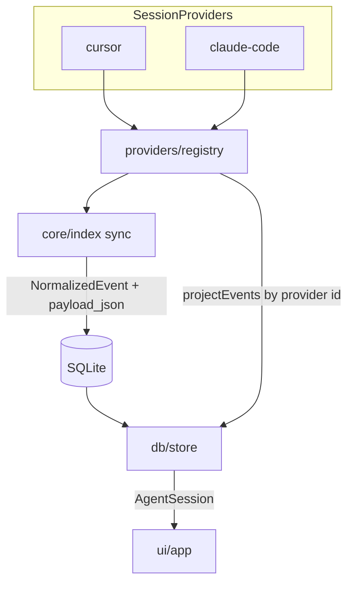

# v0.7 — Multi-Provider Architecture

## Locked decisions

- **Second provider:** Claude Code (`providers/claude-code/`). Codex stays out of this milestone (layout documented only; no stub package).
- **SQLite schema unchanged** as the core contract (`projects.provider`, `events.payload_json`, existing kinds). No new tables for v0.7.
- **Write path stays NormalizedEvent → SQLite**; **read path assembles AgentSession**. The user’s “Provider → AgentSession → SQLite” diagram is the conceptual flow; in code, `loadSession` returns [`ParsedSession`](src/core/types.ts) (normalized events) and `projectEvents` builds UI [`AgentEvent`](src/core/agent-session.ts)s.
- **DoD:** a third coding agent = new folder + registry entry; no changes to [`src/db/schema.ts`](src/db/schema.ts) or TUI structure beyond capability-gated UI.

## Target flow



## 1. Provider contract

Add [`src/providers/types.ts`](src/providers/types.ts):

```ts
export type ProviderCapabilities = {
  toolCalls: boolean
  fileChanges: boolean
  commands: boolean
  plans: boolean
}

export type ProviderProject = {
  id: string           // stable key within provider (usually source_path)
  name: string
  sourcePath: string
}

export type ProviderSessionSummary = {
  sourcePath: string
  sourceMtime: number
  sourceSize: number
  titleHint?: string
}

export interface SessionProvider {
  readonly id: string
  readonly capabilities: ProviderCapabilities
  discoverProjects(): Promise<ProviderProject[]>
  discoverSessions(project: ProviderProject): Promise<ProviderSessionSummary[]>
  loadSession(session: ProviderSessionSummary): Promise<ParsedSession>
  projectEvents(events: StoredEvent[]): AgentEvent[]
  /** Only used when capabilities.plans; default empty. */
  resolvePlans?(events: StoredEvent[]): Promise<PlanRef | undefined>
}
```

Add [`src/providers/registry.ts`](src/providers/registry.ts): `allProviders()`, `getProvider(id)` (throws or returns undefined for unknown).

## 2. Wrap Cursor as a SessionProvider

Keep existing modules under [`src/providers/cursor/`](src/providers/cursor/); add thin [`src/providers/cursor/index.ts`](src/providers/cursor/index.ts) implementing `SessionProvider`:

- `id: "cursor"`
- `capabilities: { toolCalls, fileChanges, commands, plans: true }`
- `discoverProjects` / `discoverSessions` — split today’s nested [`discoverCursorProjects`](src/providers/cursor/discover.ts)
- `loadSession` → existing [`parseSessionFile`](src/providers/cursor/parse.ts)
- `projectEvents` → [`projectCursorEvents`](src/providers/cursor/project.ts)
- `resolvePlans` → existing plans helpers

No rewrite of classify/parse logic.

## 3. Decouple core sync and store

**[`src/core/index.ts`](src/core/index.ts)** — replace hard-coded Cursor imports with:

```ts
for (const provider of allProviders()) {
  const projects = await provider.discoverProjects()
  // upsertProject(db, provider.id, …); discoverSessions; loadSession; importSession
}
```

Project uniqueness remains `UNIQUE(provider, source_path)`. Session uniqueness remains `source_path` (already absolute and provider-distinct).

**[`src/db/store.ts`](src/db/store.ts)** — remove Cursor imports; in `getAgentSession`:

```ts
const provider = getProvider(row.provider)
const events = provider.projectEvents(storedEvents)
const plan = provider.capabilities.plans
  ? await provider.resolvePlans?.(storedEvents)
  : undefined
```

**[`src/core/agent-session.ts`](src/core/agent-session.ts)** — change `source: "cursor"` → `source: string` (provider id).

**Git:** keep [`decodeCursorWorkspaceSlug`](src/core/git.ts) as Cursor-only fallback inside git discovery (no provider interface yet). Claude Code project dirs encode real paths (`-Users-…`), so repo discovery from `session_files` / `project.sourcePath` decoding can be Claude-specific later if needed; v0.7 uses existing path-hint + slug decode only for Cursor.

## 4. Claude Code provider (the second implementation)

New tree:

```
src/providers/claude-code/
  paths.ts      # CLAUDE_PROJECTS_DIR or CLAUDE_CONFIG_DIR/projects → ~/.claude/projects
  discover.ts
  parse.ts      # JSONL → NormalizedEvent
  classify.ts   # Claude tool names → EventKind
  project.ts    # StoredEvent → AgentEvent
  index.ts      # SessionProvider export
```

**Discovery (documented Claude layout):**

```
~/.claude/projects/<encoded-cwd>/
  <session-id>.jsonl
  sessions-index.json   # optional title/mtime hints when present
```

- One `ProviderProject` per encoded-cwd directory; display name = decode hyphens to a short path label (mirror Cursor’s `formatWorkspaceName` spirit).
- Sessions = top-level `*.jsonl` only (skip `subagents/`, `tool-results/`, sidechain dirs).
- Env: `CLAUDE_PROJECTS_DIR` (or derive from `CLAUDE_CONFIG_DIR`); document in [`.env.example`](.env.example) and README.

**Parse/classify:** map common Claude Code tools (`Read`, `Edit`/`Write`, `Bash`, `Grep`/`Glob`, etc.) into existing `EventKind`s; unknown tools → `tool_call` with full line in `payload_json` (`provider: "claude-code"`). Prefer resilient parsing over perfect fidelity — Claude’s JSONL schema drifts.

**Capabilities:** `{ toolCalls: true, fileChanges: true, commands: true, plans: false }` — do not fake Cursor Plan semantics. TUI plans filter/detail simply empty for these sessions.

**Fixtures:** anonymized `fixtures/claude-code/…` with 1–2 short JSONL sessions covering user/assistant + Read/Bash-style tools.

## 5. Capability-aware TUI (minimal)

In [`src/ui/app.ts`](src/ui/app.ts) / timeline filters:

- When the **loaded session’s** provider has `plans: false`, hide or no-op category `6` (plans) and skip plan chrome in the summary strip.
- Other filters stay; empty categories remain valid (e.g. no commands).
- Replace Cursor-hardcoded copy in [`src/ui/event-detail.ts`](src/ui/event-detail.ts) (“not recorded in Cursor transcripts”) with provider-neutral wording (“not recorded in this session’s transcript”).

No dashboard of providers; projects from all providers appear in one list (existing `listProjects` already joins on `projects`; show provider only if needed for disambiguation — optional small suffix in project name or leave as-is when names differ).

## 6. Tests and docs

- Unit: registry resolves cursor + claude-code; Cursor provider still passes existing tests (re-export wrappers).
- New: `test/providers/claude-code/{parse,discover,project}.test.ts` against fixtures.
- Update [`test/db/store.test.ts`](test/db/store.test.ts) for `source: string`; add one Claude-indexed session → `getAgentSession` round-trip if practical via temp DB.
- Sync test: mock/fixture both providers indexed without schema changes.
- Docs: README “Data layout” section for Claude Code; CHANGELOG **Multi-provider architecture (v0.7)**; CONTRIBUTING notes “add a provider under `src/providers/<id>` and register it”.
- Milestone label only in CHANGELOG/README — do **not** bump `package.json` version (same convention as v0.5/v0.6).

## Out of scope

- Codex provider implementation
- AI features, embeddings, cross-provider search ranking changes
- Schema migrations for capabilities (capabilities live in code on the provider, not in SQLite)
- Subagent transcript listing for either provider
- Changing OpenTUI navigation model

## Definition of done checklist

- `SessionProvider` + registry exist; Cursor is an implementation, not the data model
- `sync()` and `getAgentSession()` have zero direct `providers/cursor/*` imports
- Claude Code sessions appear in TUI/CLI after `index` / `reindex`
- SQLite schema identical; provider-specific data only in `payload_json` / `projects.provider`
- Plans UI gated by `capabilities.plans`
- Adding provider N requires only `providers/<id>/` + one registry line
