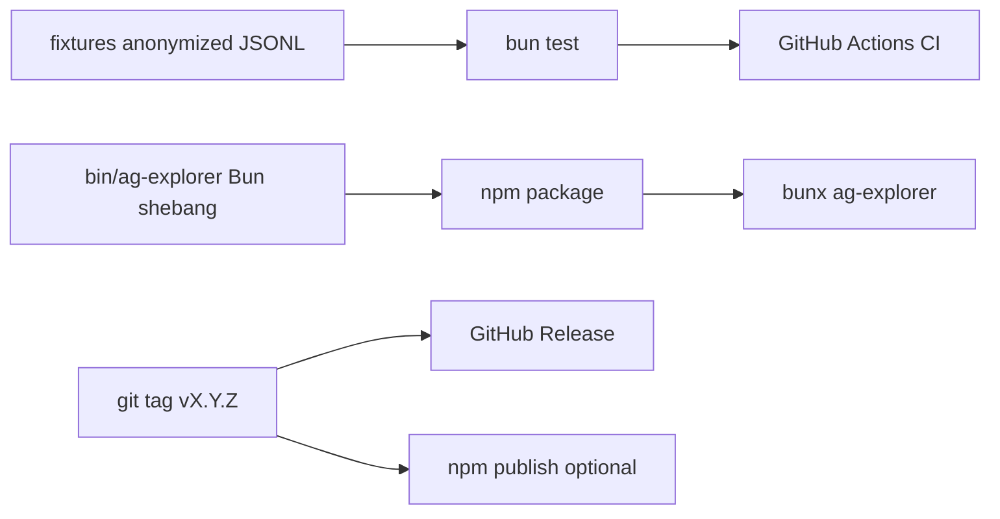

# ag-explorer promotion readiness

## Context

Today [`package.json`](package.json) only has `start` / `dev` / `typecheck`, no `bin`, no tests, no `.github/`, and the GitHub repo has empty About fields and no releases. Runtime is **Bun + OpenTUI** (Bun shebang required — Node cannot load OpenTUI’s `.scm` assets). Pure logic lives in [`src/history.ts`](src/history.ts), [`src/env.ts`](src/env.ts), [`src/clipboard.ts`](src/clipboard.ts); UI is [`src/index.ts`](src/index.ts).

**Default for “provider documentation”:** document **Cursor as the local data source** (transcript/plan layout under `~/.cursor`) plus **clipboard backends** (`pbcopy` / `wl-copy` / `xclip` / `clip` / OSC 52) in README — not LLM providers (none exist).

## 1. Anonymized fixtures + tests

Add:

```
fixtures/projects/Users-fixtureuser-workspace-projects-demo/agent-transcripts/<uuid>/<uuid>.jsonl
fixtures/plans/demo_plan_abcd1234.plan.md
test/history.test.ts
test/env.test.ts
```

Synthetic JSONL only (no real home paths, usernames, tokens). Cover:

- `formatWorkspaceName`, `resolveChatHistoryDir` / `resolvePlansDir` (via env)
- `loadWorkspaces` / `loadChats` / `loadChatDetails` against fixtures
- `<user_query>` titles, `turn_ended` skip, CreatePlan / `.plan.md` refs, malformed lines

Scripts: `"test": "bun test"`. Keep tests offline and fixture-rooted via `CURSOR_CHAT_HISTORY_DIR` / `CURSOR_PLANS_DIR`.

## 2. Installable CLI (`bunx` / npm)

Package for Bun-first install (same pattern as other OpenTUI CLIs):

- Thin entry [`bin/ag-explorer.ts`](bin/ag-explorer.ts) (or `src/cli.ts`) with `#!/usr/bin/env bun`
- `"bin": { "ag-explorer": "./bin/ag-explorer.ts" }` (or compiled `dist` if we add a small `bun build` step — prefer **shipping TS/JS source + Bun shebang** initially to avoid asset bundling complexity)
- `"files"`: `bin/`, `src/`, `LICENSE`, `README.md` (exclude fixtures unless useful as examples)
- `"engines": { "bun": ">=1.3.0" }` — no false `engines.node`
- README install block:

```bash
bunx ag-explorer
# or
bun add -g ag-explorer
```

Update clone URL to the real repo. Keep `pnpm start` / `pnpm dev` for contributors.

**Note:** First npm publish needs an npm account/token (CI secret); plan the workflow but publishing is gated on that.

## 3. GitHub Actions

| Workflow | Trigger | Jobs |
| --- | --- | --- |
| [`ci.yml`](.github/workflows/ci.yml) | PR + push to `master` | Bun + pnpm install, `typecheck`, `test` |
| [`release.yml`](.github/workflows/release.yml) | tag `v*` | Create GitHub Release from CHANGELOG section; optional `npm publish` when `NPM_TOKEN` is set |

No force-push / destructive release steps.

## 4. Docs & community files

| File | Purpose |
| --- | --- |
| [`CONTRIBUTING.md`](CONTRIBUTING.md) | Bun/pnpm setup, `test`/`typecheck`, fixture rules (never commit real transcripts), PR expectations |
| [`CHANGELOG.md`](CHANGELOG.md) | Keep a Changelog; seed `1.0.0` / Unreleased |
| [`.github/ISSUE_TEMPLATE/bug_report.yml`](.github/ISSUE_TEMPLATE/bug_report.yml) | OS, Bun version, repro |
| [`.github/ISSUE_TEMPLATE/feature_request.yml`](.github/ISSUE_TEMPLATE/feature_request.yml) | |
| [`.github/PULL_REQUEST_TEMPLATE.md`](.github/PULL_REQUEST_TEMPLATE.md) | Short checklist |

README additions: `bunx` install, Controls (existing), **Data layout** (Cursor projects/plans paths), **Clipboard** backends, Privacy, media embeds.

## 5. Screenshots / GIF

Add [`docs/assets/`](docs/assets/) with README placeholders:

- `docs/assets/demo.gif` — terminal walkthrough (workspaces → chat → copy)
- Optional still: `docs/assets/screenshot.png`

**Capture is a manual step** after packaging works (`vhs` / asciinema / terminal recording). Plan lands the directory + README image markdown; assets can be added in a follow-up commit once recorded.

## 6. GitHub About + first release

Via `gh`:

- Description: reuse package description (“Terminal UI for browsing Cursor agent chat history, built with OpenTUI”)
- Topics: `cursor`, `tui`, `opentui`, `cli`, `bun`, `chat-history`, `typescript`
- Homepage: leave empty or point at repo README

After packaging + CI land: tag `v1.0.0`, push tag, let release workflow create the GitHub Release (and npm publish if token present).

## Out of scope (for this pass)

- Standalone `bun build --compile` multi-platform binaries (can follow later; OpenTUI supports it but is heavier)
- Wiring unused [`src/plans.ts`](src/plans.ts) into the UI (document or delete in a separate cleanup if desired)
- Full TUI snapshot tests (OpenTUI testing harness) — start with pure history/env unit tests


