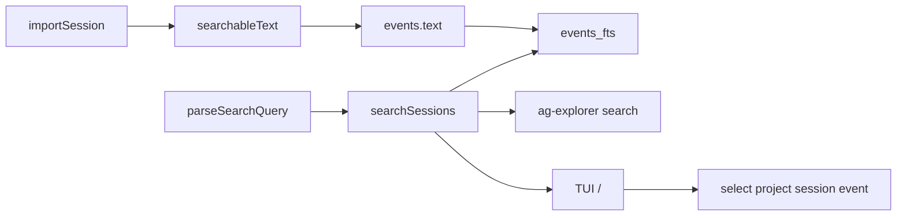

# v0.3 — Searchable History

## Context

SQLite + `events_fts` already exist ([`src/db/schema.ts`](src/db/schema.ts), [`searchEventIds`](src/db/store.ts)). Gaps: tool/error bodies are empty in FTS, no filters/grouping API, no TUI/CLI search, no file export. Timeline UI ([`src/ui/app.ts`](src/ui/app.ts)) stays **Projects | Sessions | Session Timeline**; global search is `/` (not a permanent third-pane rename).

## Locked decisions

| Choice | Decision |
| --- | --- |
| FTS content | Keep single-column `events_fts(text)`; at **write time** fill `events.text` with a searchable blob for tools/errors (messages unchanged) |
| Tool results | Cursor JSONL has no tool stdout — index **commands, paths, patterns, tool names, turn status**; document limit |
| Date filters | `before:` / `after:` filter on **`sessions.updated_at`** (event `timestamp` is always null today) |
| UI entry | **`/`** opens global search; Esc returns to timeline |
| Results shape | Group by project → session with match counts (matches the JWT example) |
| Export | `ag-explorer export <session>` writes markdown or JSON to stdout (or `-o` file) |



## 1. Searchable text at index time

Add [`src/core/search-text.ts`](src/core/search-text.ts) `searchableText(event: NormalizedEvent): string`:

- **message** — existing `event.text`
- **tool_call** — join non-empty: tool name, `payload.command`, string fields from `payload.input` (path, command, pattern, glob_pattern, old_string/new_string truncated, query, etc.)
- **turn_ended** — `status` / error-ish payload fields when present
- **other** — `event.text` plus compact JSON string values

Wire in [`src/core/writer.ts`](src/core/writer.ts) `importSession`: insert `searchableText(event)` instead of raw `event.text`. Display projection still uses payload for tools; message display still uses stored text (identical for messages).

**Requires `ag-explorer reindex`** after upgrade so existing rows pick up tool text. Note in README.

## 2. Session metadata

Extend `sessions` with **`event_count INTEGER NOT NULL DEFAULT 0`** (set in `importSession` to `parsed.events.length`). Migration: `ALTER TABLE` if missing (same pattern as current `migrate`).

Expose on list/API types:

- [`Session`](src/core/types.ts): add `startedAt`, `eventCount`, `sourceProvider` (from `projects.provider` join)
- [`listSessions`](src/db/store.ts): select `started_at`, `event_count`, `p.provider`
- `title` / `updated_at` / `started_at` already stored — just surface them

Optional index: `CREATE INDEX IF NOT EXISTS idx_events_role ON events(role)` for `role:` filters.

## 3. Search query + store API

Add [`src/core/search-query.ts`](src/core/search-query.ts):

- Parse free text + tokens: `project:`, `session:`, `role:`, `event:`, `before:`, `after:`
- Remaining tokens → FTS MATCH string (escape FTS special chars; quote multi-word phrases)
- CLI flags (`--project`, `--session`, …) merge into the same filter object

`event:` maps to SQL filters:

| Token | SQL / logic |
| --- | --- |
| `user` / `prompt` | `kind = 'message' AND role = 'user'` |
| `assistant` / `agent` | `kind = 'message' AND role = 'assistant'` |
| `run` / `command` | `kind = 'tool_call' AND payload tool Shell` (JSON `like` or `json_extract`) |
| `error` | `kind = 'turn_ended'` OR text MATCH already constrained + status-like payload |
| `tool` / `read` / `edit` / `search` / `plan` | `tool_call` + tool-name match |

Replace thin `searchEventIds` with:

```ts
searchSessions(db, query: string, filters?: SearchFilters): SearchResultGroup[]
```

Each group: `{ projectId, projectName, sessionId, sessionTitle, matchCount, hits: [{ eventId, seq, snippet }] }`, ordered by matchCount then `sessions.updated_at DESC`.

Implementation: FTS MATCH → join `events`/`sessions`/`projects` → apply filters → `GROUP BY session_id` with `COUNT(*)` → optional snippet via `snippet(events_fts, …)` or truncated `events.text`.

Cap results (e.g. 50 sessions / 5 hits each) so huge indexes stay snappy.

## 4. TUI: `/` global search + jump

In [`src/ui/app.ts`](src/ui/app.ts):

1. **`/`** (when not typing in an input) → enter search mode: show search input + results list (reuse right column or overlay box; hide timeline while searching).
2. Type query (supports inline `project:` tokens); debounce or search on Enter.
3. Results list shows grouped lines like the example (`project` / session title / N matches).
4. **Enter** on a hit → exit search mode → select matching project + session → `getAgentSession` → set timeline selection to **`event.id`** (add `setSelectedByValue` / find index by id; stop always resetting to `0` when jumping).
5. **Esc** → leave search mode, restore timeline.
6. Keep existing in-session `Filter timeline...` as local substring filter (not FTS).

Footer hints: add `/ search`.

## 5. CLI: `search` and `export`

Extend [`src/cli.ts`](src/cli.ts):

```bash
ag-explorer search <query> [--project name] [--session title|id] [--role user|assistant] [--event user|run|…] [--before ISO] [--after ISO]
ag-explorer export <sessionId|title> [--format markdown|json] [-o path]
```

- `search`: call `index()` sync first (or open DB + light sync), print grouped human-readable results (and optional `--json`).
- `export`: resolve session by numeric id or unique title substring; use [`formatSessionPlain`](src/core/export.ts) for markdown; add `formatSessionJson(agentSession)` for structured JSON (AgentSession-shaped). Default stdout; `-o` writes file.

Update usage string and [`test/cli.test.ts`](test/cli.test.ts).

## 6. Tests and docs

| Area | Coverage |
| --- | --- |
| `test/core/search-text.test.ts` | Tool command/path appear in searchable text |
| `test/core/search-query.test.ts` | Token parse + flag merge |
| `test/db/fts.test.ts` | Expand: cross-session hits, `project:` filter, tool command match after index |
| `test/cli.test.ts` | `search` / `export` smoke against fixtures |
| README | Features, `/` control, `search`/`export` examples, reindex note after upgrade |

Bump feature narrative in README Features; keep package version unless you separately cut a release.

## Out of scope

- Live file watchers / background reindex
- True tool stdout/stderr (not in Cursor transcripts)
- Replacing Session Timeline pane with a permanent Search tab
- Non-Cursor providers
