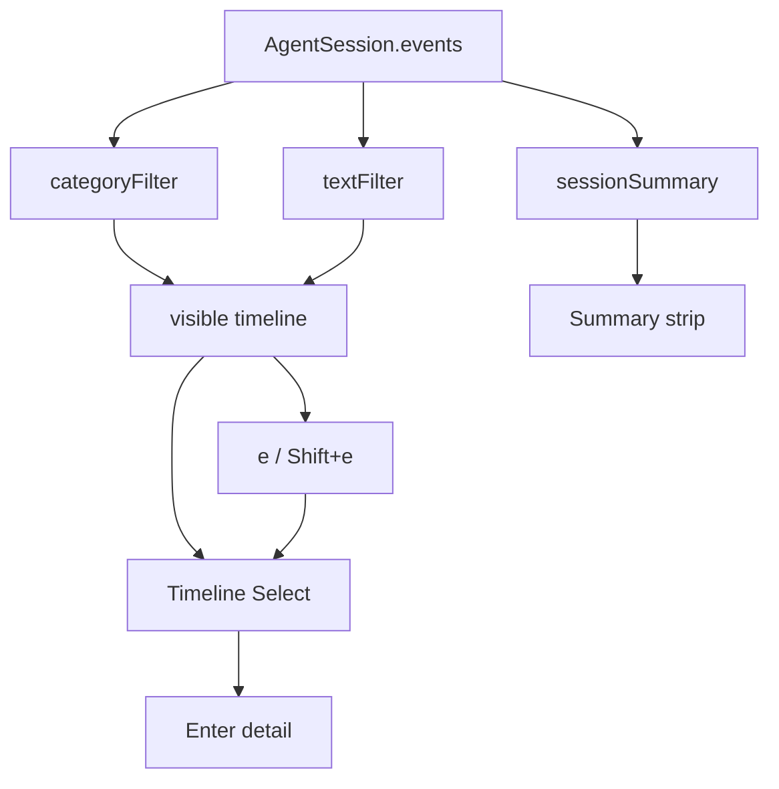

# v0.5 — Session Explorer

## Context

v0.3–v0.4 already shipped the core exploration surface:

- Projects | Sessions | Session Timeline with labels `USER` / `PLAN` / `READ` / `EDIT` / `RUN` / `AGENT` / `ERROR` (+ `SEARCH` / `TOOL` / `UNK`)
- Enter → event detail ([`src/ui/event-detail.ts`](src/ui/event-detail.ts))
- Free-text timeline filter + global `/` search
- Structured `AgentEvent` model ([`src/core/agent-session.ts`](src/core/agent-session.ts))

**Still missing for this release:** category filters, session summary strip, `e` error navigation, and product positioning.

**Cursor honesty (unchanged):** JSONL almost never has stdout/stderr/`exitCode`. Detail and stats must not invent PASS/FAIL or output. `Failed commands` is counted only when `exitCode` is present and non-zero; `e` cycles `ERROR` events (failed turns), which are the real debugging signal today.



## 1. Product positioning

Update copy only (no architecture change):

| Surface | New framing |
| --- | --- |
| [`README.md`](README.md) lead | “Terminal explorer for AI coding sessions” (local, Cursor-backed); keep privacy line |
| Features list | Lead with execution-path understanding: timeline, filters, summary, error nav |
| Controls | Document category keys, `e` / `Shift+e`, summary strip |
| [`package.json`](package.json) `description` | Match new positioning |
| TUI header in [`src/ui/app.ts`](src/ui/app.ts) | e.g. `AGExplorer — Session Explorer` |
| [`CHANGELOG.md`](CHANGELOG.md) Unreleased | Session Explorer section (filters, summary, error nav, repositioning) |

Do not change `version` (stays `1.0.0` until a release cut). Treat “v0.5” as the milestone name in changelog/docs.

## 2. Category timeline filters

Add pure helpers in [`src/ui/timeline.ts`](src/ui/timeline.ts) (or thin `src/core/session-filters.ts` if preferred for reuse):

```ts
type TimelineCategory = "all" | "messages" | "files" | "commands" | "errors" | "tools" | "plans"

const CATEGORY_TYPES: Record<Exclude<TimelineCategory, "all">, AgentEvent["type"][]> = {
  messages: ["user_prompt", "assistant_message"],
  files: ["file_read", "file_edit"],
  commands: ["command"],
  errors: ["error"], // also include command when exitCode !== 0 && !== undefined
  tools: ["tool_call", "tool_result", "search", "unknown"],
  plans: ["plan"],
}
```

Compose: `timelineEvents` → category filter → existing `filterTimelineEvents(text)`.

**UI ([`src/ui/app.ts`](src/ui/app.ts)):**

- Single active category (default `all`), combined with the existing text filter (AND).
- Compact status line under the filter input: `Filter: all · messages files commands errors tools plans` with the active one marked (e.g. `[commands]`).
- Keys when **not** typing in the filter/search inputs: `0` = all, `1`–`6` = the six categories (order as above). Update footer hints.
- Refresh timeline Select options on category change; preserve selection by event `id` when possible.

## 3. Session summary (deterministic, no LLM)

Add [`src/core/session-summary.ts`](src/core/session-summary.ts):

```ts
type SessionSummary = {
  filesRead: number      // count of file_read
  filesEdited: number    // count of file_edit
  commandsRun: number    // count of command
  failedCommands: number // command with exitCode !== undefined && exitCode !== 0
  toolCalls: number      // tool_call + tool_result + search
}
```

Counts are over **all** timeline-visible events in the session (not the active category filter), so the strip always describes the whole session.

**UI:** one-line (or two-line wrapped) summary above the timeline list when a session is loaded:

`Read 18 · Edited 6 · Run 9 · Failed 2 · Tools 34`

Hide or show zeros as `0` (always show all five metrics for a stable layout). Wire into `refreshTimeline` / session load.

Optional CLI nicety (same function): include summary block at top of `formatSessionPlain` / markdown export — keeps explorability outside the TUI.

## 4. Error navigation (`e`)

In [`src/ui/app.ts`](src/ui/app.ts) keypress handler (ignore when filter/search input focused):

- Collect error targets from the **currently visible** list (after category + text filter): events with `type === "error"`, plus `command` with known failing `exitCode`.
- `e` — select next error (wrap); `Shift+e` — previous.
- On jump: focus timeline, select that option, **expand detail** automatically (debugging path).
- If none: brief footer flash `No errors in view`.

## 5. Detail polish (light)

Align command detail headers with the explorer feel in [`src/ui/event-detail.ts`](src/ui/event-detail.ts) without inventing output:

```
Command
──────────────────
pnpm test
Exit code: 1          # only if present
```

or keep `$ command` and add a `Command` title line. When `exitCode === 0`, timeline summary may append `✓` (optional one-liner in projector or `formatTimeline` name builder)—only when exit code is known.

No heuristic pairing of Shell with following AGENT text as “output.”

## 6. Tests and docs

| Area | Coverage |
| --- | --- |
| `test/core/session-summary.test.ts` | Counts from hand-built `AgentEvent[]`; failedCommands only when exitCode set |
| `test/ui/timeline.test.ts` | Category filter mappings; compose with text needle |
| `test/ui/event-detail.test.ts` | Command title / exit-code branch unchanged honesty |
| README Controls + Features | Positioning, `0`–`6`, `e` / `Shift+e`, summary line |

No reindex required (read-time UI over existing structured kinds).

## Out of scope

- Inventing command stdout / exit codes from Cursor transcripts
- LLM session summaries
- Multi-select category chips
- Package version bump / npm release
- Non-Cursor providers
