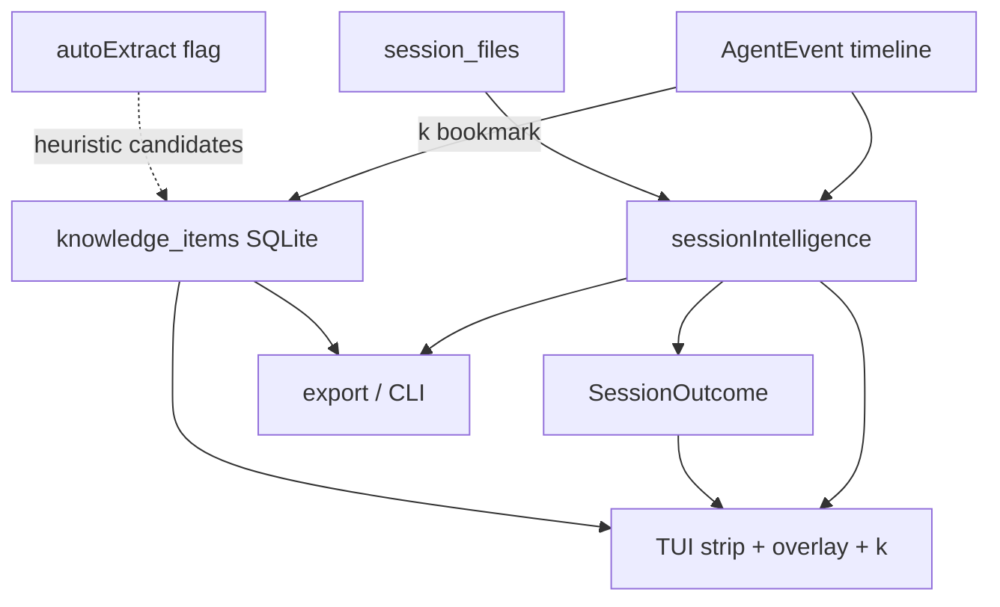

# v0.8 — Session Intelligence

## Context

Structured events ([`EventKind`](src/core/types.ts)), [`session_files`](src/core/session-files.ts), and the deterministic count strip ([`session-summary.ts`](src/core/session-summary.ts)) already exist. v0.8 turns that into **useful engineering summaries** and a durable **knowledge** store — still local-only, still no network.

**Locked scope (your picks):** deterministic core + knowledge schema/bookmarks; auto-extraction stubbed behind a flag (no LLM); knowledge persists in SQLite.



## Locked decisions

- **Derived intelligence is computed on load** from `AgentSession` (same pattern as `sessionSummary`) — not a new indexed table. Cheap, always fresh after reindex.
- **Do not invent facts** Cursor/Claude omit (e.g. exit codes). Outcome language stays honest when data is missing (`Tests: unknown`, `Final command: pnpm test` without claiming pass/fail).
- **`knowledge_items` live in SQLite** and are **user data**, not derived cache. Survive session event reimport; survive `reindex` via source-path remapping (see below).
- **`k` bookmarks** the selected timeline event (type inferred heuristically, overridable). Not available while typing in filter/search.
- **Auto-extraction** = deterministic heuristics behind `AG_EXPLORER_AUTO_KNOWLEDGE=1`. Writes `source = 'auto'` rows. No LLM client, no API keys in v0.8. Flag off by default.
- Do not bump `package.json` version (milestone name only, same as prior v0.x plans).

## 1. Types and deterministic extractors

Add [`src/core/session-intelligence.ts`](src/core/session-intelligence.ts):

```ts
type SessionIntelligence = {
  problem: string | null          // first user_prompt, truncated
  filesInvolved: string[]         // unique paths from session.files (prefer edited/created)
  commands: string[]              // command strings in order
  errors: string[]                // error.message + failing command lines
  successfulResolution: boolean | null  // null = unknown
  languages: string[]             // from path extensions (.ts, .py, …)
  libraries: string[]             // heuristic: package names in commands + common import-ish path segments
}

type SessionOutcome = {
  tests: "passed" | "failed" | "mixed" | "unknown"
  filesModified: number           // edited + created + deleted unique paths
  errorsEncountered: number
  finalCommand: string | null
}
```

Heuristics (deterministic, documented in tests):

| Field | Rule |
| --- | --- |
| `problem` | First `user_prompt` text; trim/collapse whitespace; cap ~200 chars |
| `filesInvolved` | From `session.files`; ordered edited/created/deleted then read-only |
| `commands` | All `command` events, dedupe consecutive identical |
| `errors` | `error` events + `command` with known `exitCode !== 0` |
| `successfulResolution` | `true` if any test-like final command has `exitCode === 0` and no later error/fail; `false` if last known test/command failed; else `null` |
| `languages` | Map extensions (`.ts`/`.tsx`→TypeScript, `.py`→Python, …); sorted unique |
| `libraries` | Tokens from commands matching `pnpm|npm|yarn|bun|pip|cargo|go get` package args; light path heuristics (`node_modules/X`, `@scope/pkg` in paths) — no filesystem reads |
| `tests` outcome | Scan commands for test runners (`test`, `vitest`, `jest`, `pytest`, `bun test`, …); use exit codes when present |
| `finalCommand` | Last `command` event’s command string |

Extend [`session-summary.ts`](src/core/session-summary.ts) consumers: keep the existing count strip; add a second line (or intelligence overlay) for outcome.

Format helpers:

```
Session outcome
Tests: eventually passed
Files modified: 4
Errors encountered: 3
Final command: pnpm test
```

## 2. SQLite `knowledge_items`

In [`src/db/schema.ts`](src/db/schema.ts):

```sql
CREATE TABLE IF NOT EXISTS knowledge_items (
  id INTEGER PRIMARY KEY,
  session_id INTEGER REFERENCES sessions(id) ON DELETE SET NULL,
  session_source_path TEXT NOT NULL,
  event_seq INTEGER,
  type TEXT NOT NULL,
  title TEXT NOT NULL,
  body TEXT NOT NULL,
  source TEXT NOT NULL DEFAULT 'bookmark',  -- bookmark | auto
  created_at REAL NOT NULL,
  meta_json TEXT NOT NULL DEFAULT '{}'
);
CREATE INDEX IF NOT EXISTS idx_knowledge_session ON knowledge_items(session_id);
CREATE INDEX IF NOT EXISTS idx_knowledge_source_path ON knowledge_items(session_source_path);
CREATE INDEX IF NOT EXISTS idx_knowledge_type ON knowledge_items(type);
```

Types: `decision | solution | error_solution | pattern | command | architecture | todo`.

**Reindex / reimport safety:**

- Bookmarks store **`session_source_path` + optional `event_seq`** and self-contained `title`/`body` (copied from the event at bookmark time).
- [`importSession`](src/core/writer.ts) already deletes events then reinserts; **do not delete** `knowledge_items` there. After upsert, rematch `session_id` by `session_source_path`.
- [`clearAllIndexedData`](src/core/writer.ts): delete events/sessions/projects but **preserve** `knowledge_items` (set `session_id` NULL); after rebuild, rematch by `session_source_path`.
- Session hard-delete (project/session removed from disk during sync): `ON DELETE SET NULL` keeps the knowledge row orphaned but searchable by path/title.

Store helpers in [`src/db/store.ts`](src/db/store.ts) (or `src/core/knowledge.ts` + thin store wrappers): `insertKnowledge`, `listKnowledgeForSession`, `listKnowledge` (global), `deleteKnowledge`, `rematchKnowledgeSessionIds`.

## 3. Bookmark UX (`k`) and intelligence view

In [`src/ui/app.ts`](src/ui/app.ts):

- **`k`** (timeline focused, not typing, not search/git): bookmark selected event → infer type → insert → footer flash `Saved knowledge: command`.
  - Type inference: `command`→`command`; `error` or failed command→`error_solution`; `plan`→`architecture`; `user_prompt`→`decision`; else `solution`.
  - Title = truncated event summary; body = `formatEventDetailPlain(event)`.
- **`Ctrl+I`**: intelligence overlay (mirror git-mode pattern): outcome block, derived lists (problem, files, commands, errors, languages, libraries), and knowledge items for this session. Esc closes.
- Summary strip: keep counts; append compact outcome when useful, e.g. `· Tests passed · 4 files · 3 errors` (hide unknown tests).

CLI:

- `ag-explorer knowledge [sessionRef]` — list knowledge (session or all)
- `ag-explorer intelligence <session>` — print derived + outcome (human text)
- Export markdown/JSON: include `intelligence`, `outcome`, and `knowledge` arrays ([`src/core/export.ts`](src/core/export.ts))

## 4. Optional auto-extraction stub (flag, no LLM)

[`src/core/knowledge-auto.ts`](src/core/knowledge-auto.ts):

```ts
function proposeKnowledgeCandidates(session: AgentSession): KnowledgeCandidate[]
```

Heuristics only (examples): last successful test command → `command`; each distinct error message → `error_solution`; plan overview → `architecture`. Deduplicate against existing rows (same type+title).

Wire in sync/load path behind env `AG_EXPLORER_AUTO_KNOWLEDGE` (document in [`.env.example`](.env.example)): when `1`/`true`, after loading/importing a session, insert missing `source='auto'` candidates. When unset, function exists and is unit-tested but never written from production paths.

No OpenAI/Anthropic client, no prompts, no network — stub is the **API seam** for a future LLM pass.

## 5. Tests and docs

| Area | Coverage |
| --- | --- |
| `test/core/session-intelligence.test.ts` | problem/files/commands/errors/languages/outcome matrix including missing exit codes |
| `test/core/knowledge-auto.test.ts` | candidate proposals + dedupe |
| `test/db/knowledge.test.ts` | insert, rematch after clearAll+rebuild, session delete leaves orphan |
| UI/CLI smoke | bookmark insert visible in `knowledge` CLI; intelligence print |

Docs: README features + controls (`k`, `Ctrl+I`); CHANGELOG Unreleased; `.env.example` auto flag. Note: no reindex required for derived fields; knowledge table created on migrate.

## Out of scope (later)

- LLM extraction / summarization
- Cross-session knowledge search UI (CLI list is enough for v0.8)
- Editing/deleting knowledge in TUI beyond bookmark create (CLI delete optional if cheap)
- Claiming Git authorship or inventing command stdout
