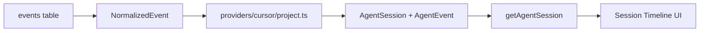

# Session timeline UI and AgentSession model

## Goal

Evolve ag-explorer from a chat transcript viewer into a **session timeline** that explains how an AI coding session unfolded: typed events (USER, PLAN, READ, SEARCH, EDIT, RUN, AGENT, ERROR) with Enter-to-expand details.

Pane labels change from **Workspaces | Chats | Transcript** to **Projects | Sessions | Session Timeline**.

## Constraint (Cursor JSONL)

Real Cursor transcripts contain only `text` and `tool_use` parts — **no `tool_result`, stdout, or stderr**. v1 RUN/ERROR detail views show **invocation input only** and explicitly note when output is not recorded in the transcript.



Storage schema stays unchanged; projection happens at read time (plus parser fix to split multi-tool lines into multiple stored events).

## 1. AgentSession data model

Add [`src/core/agent-session.ts`](src/core/agent-session.ts):

```ts
interface AgentSession {
  id: number
  title: string
  project: ProjectRef
  startedAt?: Date
  updatedAt?: Date
  source: "cursor"
  events: AgentEvent[]
  plan?: PlanRef
}

type AgentEvent =
  | UserPromptEvent
  | AssistantMessageEvent
  | PlanEvent
  | FileReadEvent
  | FileEditEvent
  | CommandEvent
  | SearchEvent
  | ErrorEvent        // reserved; populated when explicit error payload exists
  | TurnEndedEvent
  | GenericToolEvent  // fallback for unmapped tools
```

Each event carries:
- `id`, `seq` (from DB)
- `label` — timeline tag (`USER`, `READ`, `EDIT`, `RUN`, `SEARCH`, `PLAN`, `AGENT`, `ERROR`)
- `summary` — one-line preview for the list (`src/search.ts`, `pnpm test`, etc.)
- `detail` — structured fields for the detail panel

Keep [`src/core/types.ts`](src/core/types.ts) `Message` / `SessionTranscript` temporarily for copy/export helpers; UI switches to `AgentSession`.

## 2. Cursor event projection

Add [`src/providers/cursor/project.ts`](src/providers/cursor/project.ts) — maps `NormalizedEvent[]` → `AgentEvent[]`:

| Cursor signal | AgentEvent | Label | Summary source |
| --- | --- | --- | --- |
| user `message` | UserPromptEvent | USER | first line of prompt |
| assistant `message` (short) | AssistantMessageEvent | AGENT | truncated text |
| assistant `message` (long) | AssistantMessageEvent | AGENT | first line + ellipsis |
| `CreatePlan` tool | PlanEvent | PLAN | plan name |
| `Read` tool | FileReadEvent | READ | `input.path` |
| `Write` / `StrReplace` | FileEditEvent | EDIT | basename(path) |
| `Shell` tool | CommandEvent | RUN | `input.command` |
| `Grep` tool | SearchEvent | SEARCH | `input.pattern` |
| `Glob` tool | SearchEvent | SEARCH | `input.glob_pattern` |
| `turn_ended` | TurnEndedEvent | (hidden) | skip in timeline |
| other tools | GenericToolEvent | TOOL | tool name |

**Parser fix** in [`src/providers/cursor/parse.ts`](src/providers/cursor/parse.ts):
- Emit **one `NormalizedEvent` per `tool_use` part** (137+ real lines have multiple tools).
- Handle alternate turn end shape `{"type":"turn_ended","status":"..."}` without `role`.
- When a line has text + tools, emit message event then tool events in order.

Re-index not required for correctness if projection splits multi-tool payloads at read time, but **prefer fixing parse** so each tool gets its own `seq` and timeline ordering is stable. Add fixture + test; existing sessions re-index on next sync when mtime unchanged — accept that old index rows may collapse multi-tool lines until user runs `ag-explorer reindex` (document in README one-liner).

## 3. Store API

Extend [`src/db/store.ts`](src/db/store.ts):

- `getAgentSession(db, sessionId): Promise<AgentSession>` — load session row + project name + events, call cursor projector, attach `plan` from existing plan-path resolution.
- Deprecate UI use of `getSessionTranscript()` (keep for tests/copy fallback initially).

UI continues to import **only** `db/store` + `core/agent-session`, not `providers/cursor/*`.

## 4. Timeline formatters

Add [`src/ui/timeline.ts`](src/ui/timeline.ts):
- `formatTimelineLine(event)` → styled one-liner: `READ  src/search.ts` with colored label + arrow separators between items handled by list layout.
- `filterTimelineEvents(events, needle)` — filter on label + summary + detail text.

Add [`src/ui/event-detail.ts`](src/ui/event-detail.ts) — plain-text detail renderers:

| Event | Detail format |
| --- | --- |
| FileEditEvent (StrReplace) | unified diff: `- old_string` / `+ new_string` lines |
| FileEditEvent (Write) | `+ path` + first N lines of `contents` |
| CommandEvent | `$ command` + block: `Output not recorded in Cursor transcript.` |
| FileReadEvent | `Path: …` (+ offset/limit if present in input) |
| SearchEvent | `Pattern: …` or `Glob: …` |
| PlanEvent | plan name + resolved path |
| UserPromptEvent / AssistantMessageEvent | full text |
| GenericToolEvent | JSON pretty-print of tool input |

No fake PASS/FAIL lines for Shell in v1.

## 5. UI layout ([`src/ui/app.ts`](src/ui/app.ts))

**Rename panes/titles:**
- `Workspaces` → `Projects`
- `Chats` → `Sessions`
- `Transcript` → `Session Timeline`

**Right pane split vertically:**
1. **Timeline list** — `SelectRenderable` of `AgentEvent` summaries with `↓` visual flow (description field or prefix column for arrows).
2. **Detail panel** — `ScrollBox` + `TextRenderable`, shown when timeline has focus and user presses **Enter** on selected event (toggle expand/collapse). Default: collapsed hint `Enter — event details`.

**Focus order:** Projects → Sessions → Timeline → Detail (Detail read-only, auto-populated on Enter from timeline).

**Keys:**
- `Enter` on timeline — toggle/show detail for selected event
- `y` / `Ctrl+Y` — copy detail text (or full timeline plain export)
- `Tab` — cycle focus
- Filter input retained above timeline: placeholder `Filter timeline...`

**Copy/export:** add [`src/core/export.ts`](src/core/export.ts) `formatSessionPlain(agentSession)` for clipboard.

Remove dependency on [`src/core/format.ts`](src/core/format.ts) `formatMessages()` in the main UI path (keep for any legacy tests until migrated).

## 6. Fixtures and tests

Add fixture [`fixtures/.../66666666-....jsonl`](fixtures/) — session with Shell, Read, StrReplace, Grep, CreatePlan in realistic order.

| Test file | Coverage |
| --- | --- |
| `test/providers/cursor/project.test.ts` | tool → AgentEvent mapping, multi-tool line expansion |
| `test/ui/timeline.test.ts` | summary lines, filter |
| `test/ui/event-detail.test.ts` | StrReplace diff, Command input-only notice |
| `test/db/store.test.ts` | `getAgentSession` shape + plan attachment |
| Update `test/core/index.test.ts` DoD | compare `AgentSession` snapshots (events count + labels), not just messages |

## 7. Docs

Update [`README.md`](README.md) Controls section:
- Pane names and Enter-for-details behavior
- Note: command output not stored in Cursor JSONL; RUN shows command only
- Recommend `ag-explorer reindex` once after upgrade if timelines look incomplete (multi-tool parse fix)

## Out of scope

- Heuristic Shell output pairing
- Live file watchers
- FTS search wired into timeline filter (keep FTS schema; filter remains in-memory on loaded session)
- Non-Cursor providers
