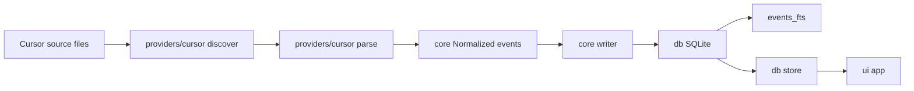

# SQLite local index architecture

## Goal

Cursor files remain the source of truth. ag-explorer maintains a derived SQLite index. This release is architectural: folder refactor, Cursor ingestion → normalized events → SQLite (+ FTS5), CLI `index` / `reindex`, provider-agnostic UI, and fixture-backed test infrastructure.

## User-visible startup change

| Before | After |
| --- | --- |
| scan → parse everything → display | sync changed files → query SQLite → display |

First launch (or empty DB) still does a full index once; later launches only touch new/changed/deleted sources.

## Definition of done

Deleting the SQLite DB file and restarting `ag-explorer` recreates **exactly the same usable history** (same projects, sessions, displayable messages, plan paths) from the source files. Covered by an automated rebuild/idempotence test.

## Defaults (locked)

- **Driver:** `bun:sqlite` (no new npm dependency).
- **Env:** `AG_EXPLORER_DB_PATH` (expand `~` / `$HOME`). Default: `$HOME/.ag-explorer/index.sqlite`.
- **Provider:** Cursor only in this release; `projects.provider` reserved for future sources.
- **No per-tool tables.** Provider specifics live in `events.payload_json`.
- **Plans:** Resolved in the Cursor provider (not a SQL table); UI receives opaque `planPaths: string[]` from the store.
- **FTS UI:** Schema + triggers now; search UI later.

## Target folder structure

```
src/
  providers/
    cursor/
      discover.ts      -- walk Cursor projects layout → session files + stat
      parse.ts         -- JSONL → NormalizedEvent[] + session title
      plans.ts         -- plan path resolution from payloads / plans dir
      paths.ts         -- CURSOR_CHAT_HISTORY_DIR / CURSOR_PLANS_DIR resolution
  db/
    schema.ts          -- DDL, openDatabase(), migrate
    paths.ts           -- resolveDbPath() from AG_EXPLORER_DB_PATH
    store.ts           -- SQL queries → core view models
  core/
    types.ts           -- NormalizedProject / Session / Event (provider-agnostic)
    index.ts           -- index(), sync(), rebuild()
    writer.ts          -- transaction-safe upsert / prune / event insert
    format.ts          -- transcript formatting for display/clipboard
    env.ts             -- .env load + path expansion
    clipboard.ts       -- clipboard backends
  ui/
    app.ts             -- OpenTUI (moved from index.ts)
    theme.ts
  cli.ts               -- argv: (default)|index|reindex
```

[`bin/ag-explorer.ts`](bin/ag-explorer.ts) → `src/cli.ts`.

**Move map (from today)**

| Today | After |
| --- | --- |
| `src/history.ts` (discovery/parse) | `providers/cursor/*` + thin re-exports only if needed for tests |
| `src/history.ts` (formatters) | `core/format.ts` |
| `src/plans.ts` | `providers/cursor/plans.ts` |
| `src/env.ts` | `core/env.ts` |
| `src/clipboard.ts` | `core/clipboard.ts` |
| `src/theme.ts` | `ui/theme.ts` |
| `src/index.ts` | `ui/app.ts` + `cli.ts` |

Delete or shrink the old flat modules once callers are updated. Avoid long-lived shims unless tests need a short transition.

## Pipeline



## Provider-agnostic UI (hard rule)

[`ui/app.ts`](src/ui/app.ts) must not:

- Read JSONL or call `fs` on transcript paths
- Know `agent-transcripts`, workspace slugs, or Cursor env vars
- Import from `providers/cursor/*`

UI talks only to:

- `core/index` → `index()` on startup
- `db/store` → `listProjects()`, `listSessions(projectId)`, `getSessionTranscript(sessionId)` returning `{ messages, planPaths }`
- `core/format` / `core/clipboard` for display and copy

Labels may still say “workspaces” / “chats” as product language; types should be `Project` / `Session` / `Message` from `core/types`, not `WorkspaceSummary` tied to Cursor layout. Map DB rows in `db/store`, not in the UI.

Plan section: if `planPaths.length > 0`, show paths; UI does not interpret CreatePlan / `.plan.md` naming.

## Normalized event model

```ts
type NormalizedEvent = {
  kind: "message" | "tool_call" | "turn_ended" | "other"
  role: string | null
  text: string
  payload: Record<string, unknown>
  source_offset: number
  timestamp: number | null
}
```

**Tool call (no tools table):**

```json
{
  "kind": "tool_call",
  "role": "assistant",
  "text": "",
  "payload": {
    "tool": "Shell",
    "command": "pnpm test",
    "provider": "cursor"
  }
}
```

**User message:**

```json
{
  "kind": "message",
  "role": "user",
  "text": "How do I run the demo app?",
  "payload": { "provider": "cursor" }
}
```

`payload_json` stores `payload` only. Provenance: `sessions.source_*` + `events.source_offset`.

**Cursor → kind mapping** (lives only in `providers/cursor/parse.ts`)

| Cursor signal | `kind` | `payload` extras |
| --- | --- | --- |
| `role: turn_ended` | `turn_ended` | `{ provider }` |
| `tool_use` parts | `tool_call` | `{ tool, command?, input?, provider }` |
| text parts | `message` | `{ provider }` (+ user query extract) |
| else | `other` | `{ provider, … }` |

Mixed text + tool_use on one line: one event — `tool_call` if text empty; else `message` with `payload.tools` array. Document in the Cursor parser.

## Schema

```sql
CREATE TABLE projects (
  id INTEGER PRIMARY KEY,
  provider TEXT NOT NULL,
  name TEXT NOT NULL,
  source_path TEXT NOT NULL,
  UNIQUE (provider, source_path)
);

CREATE TABLE sessions (
  id INTEGER PRIMARY KEY,
  project_id INTEGER NOT NULL REFERENCES projects(id) ON DELETE CASCADE,
  title TEXT NOT NULL,
  source_path TEXT NOT NULL UNIQUE,
  source_mtime REAL NOT NULL,
  source_size INTEGER NOT NULL,
  started_at REAL,
  updated_at REAL NOT NULL
);

CREATE TABLE events (
  id INTEGER PRIMARY KEY,
  session_id INTEGER NOT NULL REFERENCES sessions(id) ON DELETE CASCADE,
  seq INTEGER NOT NULL,
  kind TEXT NOT NULL,
  role TEXT,
  text TEXT NOT NULL DEFAULT '',
  payload_json TEXT NOT NULL,
  source_offset INTEGER NOT NULL,
  timestamp REAL,
  UNIQUE (session_id, seq)
);

CREATE INDEX idx_sessions_project_updated ON sessions(project_id, updated_at DESC);
CREATE INDEX idx_events_session_seq ON events(session_id, seq);
CREATE INDEX idx_events_kind ON events(kind);

CREATE VIRTUAL TABLE events_fts USING fts5(
  text,
  content = 'events',
  content_rowid = 'id'
);

CREATE TRIGGER events_ai AFTER INSERT ON events BEGIN
  INSERT INTO events_fts(rowid, text) VALUES (new.id, new.text);
END;
CREATE TRIGGER events_ad AFTER DELETE ON events BEGIN
  INSERT INTO events_fts(events_fts, rowid, text) VALUES ('delete', old.id, old.text);
END;
CREATE TRIGGER events_au AFTER UPDATE ON events BEGIN
  INSERT INTO events_fts(events_fts, rowid, text) VALUES ('delete', old.id, old.text);
  INSERT INTO events_fts(rowid, text) VALUES (new.id, new.text);
END;
```

## Index API (`core/index.ts`)

| Function | Behavior |
| --- | --- |
| `sync()` | Incremental: discover via registered provider(s), upsert projects, new / modified (`mtime`+`size`) / deleted sessions; reparse dirty only; prune orphans. |
| `rebuild()` | Clear derived data (or recreate DB file), full import. |
| `index()` | Ensure schema; then `sync()`. Used by TUI startup and `ag-explorer index`. |

**Transaction safety:** one transaction per dirty session (upsert session → delete old events → insert events → commit). Prunes transactional. Per-session failure rolls back that session only. `PRAGMA foreign_keys = ON`.

**Detection:** new path → insert; mtime/size mismatch → full session rewrite; missing path → delete session (cascade); orphan projects → delete. Append-only partial parse out of scope.

This release registers the Cursor provider only; `sync()` calls into `providers/cursor/discover` + `parse`.

## CLI

```bash
ag-explorer              # index() then UI
ag-explorer index        # index() / sync; print summary; exit
ag-explorer reindex      # rebuild(); print summary; exit
```

## Test infrastructure

### Fixture matrix (`fixtures/`)

Anonymized Cursor-shaped layout under `fixtures/projects/…/agent-transcripts/<uuid>/<uuid>.jsonl` plus `fixtures/plans/` where needed. No real home paths, usernames, or secrets.

| Fixture | Purpose |
| --- | --- |
| **normal session** | Happy-path user/assistant messages |
| **Plan session** | CreatePlan / `.plan.md` refs → store returns `planPaths` |
| **malformed JSONL** | Bad lines skipped; valid lines still indexed |
| **incomplete final line** | Trailing partial line without `\n` ignored; prior lines OK |
| **large conversation** | Many lines (enough to stress parse/sync; e.g. hundreds) still correct counts |
| **updated transcript** | Same path, richer content after mtime/size change → events replaced |
| **deleted transcript** | Indexed then removed from disk → pruned from DB |

Tests copy fixtures into a temp directory when mutating (updated / deleted) so the repo fixtures stay immutable.

### Test suites

- `test/providers/cursor/parse.test.ts` — normalization cases above
- `test/core/index.test.ts` — `sync` / `rebuild` / unchanged skip / update / delete / **DoD**: wipe DB + `index()` ≡ prior snapshot of projects/sessions/display messages
- `test/db/fts.test.ts` — FTS match returns expected event ids
- `test/cli.test.ts` — argv routing smoke (or direct CLI handler)
- `test/core/format.test.ts` — migrated formatter tests from today’s history tests

Keep tests offline; point `CURSOR_CHAT_HISTORY_DIR` / `CURSOR_PLANS_DIR` / `AG_EXPLORER_DB_PATH` at temp paths.

## Config / docs

- [`.env.example`](.env.example): `AG_EXPLORER_DB_PATH=$HOME/.ag-explorer/index.sqlite`
- [`README.md`](README.md): folder/architecture blurb, startup sync behavior, `index` / `reindex`, recreate-from-sources DoD
- Create `$HOME/.ag-explorer/` on open; never ship DB in the package

## Out of scope

- File watchers / live refresh
- Append-only partial JSONL reparse
- Additional providers beyond Cursor
- Per-tool SQL tables
- FTS search UI in the TUI
- Plans table
- Visual OpenTUI redesign
