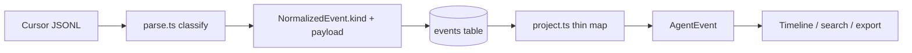

# v0.4 — Structured Agent Sessions

## Context

Today the **UI** already has a rich [`AgentEvent`](src/core/agent-session.ts) union (via read-time projection in [`project.ts`](src/providers/cursor/project.ts)), but the **normalized DB** still stores coarse [`EventKind`](src/core/types.ts): `message | tool_call | turn_ended | other`. Tool specifics live only in `payload_json`. `ErrorEvent` is typed but never emitted; unrecognized lines become empty `other` or are dropped; Cursor JSONL still has no `tool_result` / stdout / exit codes.

v0.4 locks classification at **parse/import time** so the index itself represents agent execution.

## Locked decisions

- **Write-time kinds:** Expand `EventKind` to structured values; store them in `events.kind` (TEXT; no new tables).
- **No invented results:** Do not fabricate `exitCode`, stdout, or `tool_result` from Cursor data that does not include them. Types exist for forward compatibility; populate only when present.
- **Unknown preservation:** Unrecognized *parsed* JSON → `kind: "unknown"` with `payload.original` = the full line object (and `provider: "cursor"`). Malformed complete lines stay skipped (same as today) to avoid FTS noise.
- **Errors:** `turn_ended` with `status: "error"` (and optional `error` string) → `kind: "error"`; visible on timeline as `ERROR`. Successful `turn_ended` stays stored but timeline-hidden.
- **Unmapped tools:** Stay `kind: "tool_call"` (rename UI `generic_tool` → `tool_call`). Specific tools get specific kinds.
- **Reindex required** after upgrade (`ag-explorer reindex`) so existing rows get new kinds.

## Target `EventKind` / `AgentEvent.type` (aligned)

| Kind | Cursor source | Payload highlights |
| --- | --- | --- |
| `user_prompt` | user message text | text in `events.text` |
| `assistant_message` | assistant text | text in `events.text` |
| `plan` | `CreatePlan` | `name`, `path?`, `overview?`, `todos?` |
| `file_read` | `Read` | `path`, `offset?`, `limit?` |
| `file_edit` | `Write` / `StrReplace` / `Delete` | `path`, `editKind`, edit fields |
| `command` | `Shell` | `command`, `description?`, `working_directory?` (no fake `exitCode`) |
| `search` | `Grep` / `Glob` | pattern/glob/path + optional grep extras when present |
| `tool_call` | any other `tool_use` | `tool`, `input` |
| `tool_result` | content part `type: "tool_result"` if ever seen | preserve part fields |
| `error` | `turn_ended` + error status | `status`, `message` |
| `turn_ended` | successful turn end | `status` |
| `unknown` | parsed JSON, no known shape | `original: <full object>` |

Keep `role`, `source_offset`, `timestamp` as today. Message kinds still put display text in `events.text`; tool/structured kinds keep `text` as searchable blob via existing [`searchableText`](src/core/search-text.ts).

## 1. Types

**[`src/core/types.ts`](src/core/types.ts)** — expand `EventKind` to the table above (drop coarse-only `message` / `other`; migration of old rows is via reindex).

**[`src/core/agent-session.ts`](src/core/agent-session.ts)** — align discriminators:
- Rename `generic_tool` → `tool_call` (`ToolCallEvent`)
- Add `ToolResultEvent` (`type: "tool_result"`)
- Add `UnknownEvent` (`type: "unknown"`, `original: Record<string, unknown>`)
- Enrich `CommandEvent` / `PlanEvent` / `SearchEvent` / `FileEditEvent` (`editKind` includes `"delete"`) with optional metadata fields above
- `isTimelineVisible`: hide `turn_ended` only; show `error` and `unknown`

## 2. Cursor parser classification

**[`src/providers/cursor/parse.ts`](src/providers/cursor/parse.ts)** — move tool→kind mapping here (today only emits `tool_call`):

- Capture full `turn_ended` fields: `status`, `error` (string if present).
- Per `tool_use`: classify by tool name into structured kinds; build typed `payload` (still include `provider`, `tool`, and full `input` for fidelity).
- Per `tool_result` content part (if any): emit `tool_result`.
- Text + tools on one line: emit message kind then tool kinds in order (unchanged split behavior).
- If line parses but yields no known role/content/turn shape: single `unknown` with `payload.original = entry`.
- Empty `other`-style stubs: stop emitting empty rows.

Extract shared classify helpers if needed so [`project.ts`](src/providers/cursor/project.ts) does not duplicate tool-name maps (prefer single module e.g. `providers/cursor/classify.ts` used by parse; project only maps stored → UI labels/summaries).

## 3. Thin projection + UI

**[`src/providers/cursor/project.ts`](src/providers/cursor/project.ts)** — switch on `event.kind` (near-identity): fill `label` / `summary` / typed fields from payload. Map `error` → `ERROR` label; `unknown` → `TOOL` or new label `UNK` (prefer **`UNK`** + theme color in [`timeline.ts`](src/ui/timeline.ts)).

**[`src/ui/event-detail.ts`](src/ui/event-detail.ts)** / **[`timeline.ts`](src/ui/timeline.ts)** / export:
- Detail for `command`: `$ command` + optional cwd; keep honest note that output/exit code are not in Cursor transcripts unless fields exist
- Detail for `error`: status + message
- Detail for `unknown`: pretty-print `original`
- Detail for `tool_result`: pretty-print payload
- Update `generic_tool` branches → `tool_call`

## 4. Search / FTS / filters

**[`src/core/search-text.ts`](src/core/search-text.ts)** — branch on new kinds (message-like vs structured); for `unknown` index string values from `original`; for `error` index status/message.

**[`src/core/search-query.ts`](src/core/search-query.ts)** — simplify `event:` filters to prefer `e.kind` directly (e.g. `run` → `kind = 'command'`, `error` → `kind = 'error'`, `read` → `file_read`, …). Keep tool-name fallback only where useful.

No schema DDL change required (`kind` is already TEXT).

## 5. Fixtures and tests

Extend tool-rich fixture (or add a dedicated session) with:
- `turn_ended` `{ "type":"turn_ended","status":"error","error":"…" }`
- `Delete` tool_use
- richer `Shell` / `CreatePlan` / `Grep` inputs
- one unrecognized top-level JSON object (e.g. `{ "type":"future_event","foo":1 }`) → `unknown`

| Test | Assert |
| --- | --- |
| `test/providers/cursor/parse.test.ts` | Structured kinds + payloads; unknown preserves original; error turn; no empty other |
| `test/providers/cursor/project.test.ts` | Kind → AgentEvent; ERROR visible; unknown detail |
| `test/core/search-text.test.ts` / `test/db/fts.test.ts` | New kinds searchable; `event:error` / `event:run` use kind |
| `test/ui/event-detail.test.ts` | error / unknown / delete edit rendering |
| `test/core/index.test.ts` DoD | After rebuild, event kind histogram includes non-message kinds; unknown + error present when fixture has them |

## 6. Docs

- [`README.md`](README.md): note structured session index; `ag-explorer reindex` after upgrade; Cursor still omits tool stdout/`tool_result` today
- [`CHANGELOG.md`](CHANGELOG.md) under Unreleased: structured event kinds + unknown preservation

## Out of scope

- Heuristic pairing of Shell with following assistant text as “output”
- Per-tool SQL tables
- Non-Cursor providers
- Package version bump / release cut (unless requested separately)
