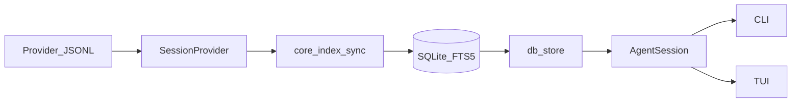

# Design & Architecture

AGExplorer is a local-only terminal explorer for AI coding agent sessions. It reads on-disk transcript files from pluggable session providers (Cursor and Claude Code today), builds a derived SQLite index, and exposes that data through a CLI and an OpenTUI interface.

There is **no HTTP or REST API**. The programmatic surface is an in-process library layer consumed by the CLI and TUI.

## Overview

| Layer | Technology | Role |
| --- | --- | --- |
| Runtime | Bun ≥ 1.3 | Required for OpenTUI Tree-sitter assets and `bun:sqlite` |
| UI | `@opentui/core` | Full-screen terminal interface |
| Index | SQLite + FTS5 | Derived cache for fast startup and search |
| Providers | TypeScript modules | Translate provider-specific JSONL into normalized events |

**Source of truth:** provider transcript JSONL files on disk.

**Derived cache:** SQLite index at `AG_EXPLORER_DB_PATH` (default `~/.ag-explorer/index.sqlite`). Deleting the index and restarting recreates the same history from source files.

**Privacy:** All reads are local. Nothing is uploaded or sent over the network.

## High-level architecture



### Data flow

1. **Discover** — Each `SessionProvider` scans its configured data directories and returns projects and session file paths.
2. **Sync** — `core/index.ts` compares on-disk mtimes/sizes with the index and imports only new or changed sessions via `core/writer.ts`.
3. **Store** — Normalized events land in SQLite (`events`, `session_files`, FTS triggers). Provider-specific fields stay in `payload_json`.
4. **Project** — On read, `db/store.ts` loads stored events and calls `provider.projectEvents()` to produce rich `AgentEvent` objects for the timeline.
5. **Consume** — CLI commands and the TUI call the same store and core helpers; there is no separate server tier.

### Repository layout

| Path | Purpose |
| --- | --- |
| `bin/ag-explorer.ts` | Published npm bin entry |
| `src/cli.ts` | CLI router; default command launches TUI |
| `src/cli-commands.ts` | CLI argument parsers and command runners |
| `src/providers/` | Provider implementations and registry |
| `src/core/` | Index sync, types, search, export, git, intelligence, knowledge |
| `src/db/` | Schema, paths, store queries, knowledge persistence |
| `src/ui/` | OpenTUI application, timeline, event detail, theme |
| `fixtures/` | Anonymized provider fixtures for tests |
| `test/` | Bun tests |

## API

The programmatic layer is the shared library surface. Integrators import modules directly; there is no remote endpoint.

### SessionProvider contract

Defined in `src/providers/types.ts`:

```typescript
interface SessionProvider {
  readonly id: string
  readonly capabilities: ProviderCapabilities
  discoverProjects(): Promise<ProviderProject[]>
  discoverSessions(project: ProviderProject): Promise<ProviderSessionSummary[]>
  loadSession(session: ProviderSessionSummary): Promise<ParsedSession>
  projectEvents(events: StoredEvent[]): AgentEvent[]
  resolvePlans?(events: StoredEvent[]): Promise<PlanRef | undefined>
}
```

**Capabilities** gate UI features per provider:

| Capability | Meaning |
| --- | --- |
| `toolCalls` | Provider exposes structured tool call events |
| `fileChanges` | File read/edit events are available |
| `commands` | Shell command events are available |
| `plans` | Linked plan files can be resolved (Cursor only today) |

**Registry** (`src/providers/registry.ts`):

- `allProviders()` — iterate registered providers
- `getProvider(id)` — lookup by id (throws if unknown)
- `tryGetProvider(id)` — optional lookup

**Configured providers** (`src/providers/configured.ts`): determines which providers are active based on environment variables (e.g. `CURSOR_CHAT_HISTORY_DIR`, `CLAUDE_PROJECTS_DIR`).

### Write path (index sync)

| Module | Key exports | Role |
| --- | --- | --- |
| `src/core/index.ts` | `index()`, `sync()`, `rebuild()`, `getDatabase()` | Orchestrates incremental sync and full rebuild |
| `src/core/writer.ts` | `importSession`, `upsertProject`, `deleteSession`, … | Upserts projects/sessions/events into SQLite |
| `src/core/types.ts` | `EventKind`, `NormalizedEvent`, `ParsedSession` | Shared normalized event model |

**Event kinds** stored at write time:

`user_prompt`, `assistant_message`, `plan`, `file_read`, `file_edit`, `command`, `search`, `tool_call`, `tool_result`, `error`, `turn_ended`, `unknown`

Providers emit `NormalizedEvent` objects. Unknown or provider-specific data is preserved in `payload_json` rather than dropped.

**Sync behavior:**

- Incremental: only sessions whose `source_mtime` or `source_size` changed are re-imported.
- Prune: projects/sessions removed from disk are deleted from the index.
- Rebuild: `rebuild()` wipes indexed data and re-imports everything.

### Read path (store)

| Module | Key exports | Role |
| --- | --- | --- |
| `src/db/store.ts` | `listProjects`, `listSessions`, `getAgentSession`, `searchSessions`, `resolveSessionId`, … | Primary read API |
| `src/core/agent-session.ts` | `AgentSession`, `AgentEvent` | Rich timeline projection |
| `src/db/knowledge-store.ts` | `listKnowledge`, `listKnowledgeForSession`, … | User-saved knowledge items |

**`getAgentSession(db, sessionId)`** is the central read operation:

1. Load session metadata and stored events from SQLite.
2. Resolve the provider and call `projectEvents()` to produce timeline-ready `AgentEvent[]`.
3. Optionally resolve linked plan files via `resolvePlans()`.
4. Attach session file relationships from `session_files`.

### Schema

Defined in `src/db/schema.ts`:

| Table | Purpose |
| --- | --- |
| `projects` | Provider + source path + display name |
| `sessions` | Title, source path, mtime/size, timestamps, event count |
| `events` | Normalized events with kind, role, text, payload_json, seq |
| `session_files` | File paths touched in a session (read/edit relations) |
| `knowledge_items` | User bookmarks and auto-extracted knowledge |
| `events_fts` | FTS5 virtual table (content-synced via triggers) |

Indexes support project/session listing, event ordering, kind/role filtering, and full-text search.

### Domain modules

| Module | Purpose |
| --- | --- |
| `src/core/search-query.ts` | Search query DSL parsing; CLI date flags |
| `src/core/export.ts` | `formatSessionPlain`, `formatSessionJson` |
| `src/core/git.ts` | Live Git context (nearby commits, diffs); heuristic correlation |
| `src/core/session-intelligence.ts` | Deterministic derived fields (problem, files, errors, outcome) |
| `src/core/knowledge.ts` | Knowledge bookmark creation and formatting |
| `src/core/knowledge-auto.ts` | Heuristic auto-extraction (no LLM) |
| `src/core/knowledge-sync.ts` | Applies auto-knowledge on session load when enabled |
| `src/core/session-summary.ts` | Session-wide stats (reads, edits, commands, failures) |
| `src/core/clipboard.ts` | Platform clipboard backends for TUI copy |

### Configuration

| Module | Purpose |
| --- | --- |
| `src/core/env.ts` | Loads `.env`; expands `~`, `$HOME`, `${HOME}` |
| `src/db/paths.ts` | Resolves `AG_EXPLORER_DB_PATH`; handles legacy migration from `~/.chviewer` |

Environment variables are documented in [`.env.example`](../.env.example).

## CLI

### Entry points

```
bin/ag-explorer.ts  →  src/cli.ts  →  src/cli-commands.ts
                                      ↘ src/ui/app.ts (default)
```

- **Router** (`src/cli.ts`): parses `process.argv[2]`, dispatches to command handlers or launches the TUI.
- **Commands** (`src/cli-commands.ts`): argument parsers (`parse*CliArgs`) and runners (`run*Command`).

### Commands

| Command | Sync first? | Description |
| --- | --- | --- |
| *(none)* / `tui` | Yes (`index()`) | Open the TUI |
| `index` | — | Incremental sync; print summary |
| `reindex` | — | Wipe and rebuild index |
| `search <query>` | Yes | Full-text search with optional filters |
| `export <id\|title>` | Yes | Export session as markdown or JSON |
| `git <id\|title>` | Yes | Show Git context for a session |
| `intelligence <id\|title>` | Yes | Show derived session intelligence |
| `knowledge [id\|title]` | Yes | List knowledge items (all or per session) |

**Sync-before-run pattern:** Query commands call `await index()` before reading from the store so results reflect the latest on-disk transcripts.

**Exit codes:** Search returns `1` when no results are found; other commands return `1` on missing sessions or parse errors.

### Separation of concerns

- `cli.ts` owns routing, env loading, and the default TUI launch.
- `cli-commands.ts` owns CLI-specific parsing and stdout formatting.
- Business logic lives in `core/` and `db/` — CLI is a thin consumer.

## UI

The UI is a single full-screen OpenTUI application, not a web app with URL routes. Navigation uses focus modes and overlays.

### Application structure

| File | Role |
| --- | --- |
| `src/ui/app.ts` | Main app: pane layout, input handling, overlay management |
| `src/ui/timeline.ts` | Timeline rendering, category filters, summary strip |
| `src/ui/event-detail.ts` | Detail pane: diffs, commands, reads |
| `src/ui/theme.ts` | Color palette |
| `src/ui/providers.ts` | Provider chip formatting in header |

### Layout (default mode)

```
┌─────────────────────────────────────────────────────────┐
│ Header: provider chips, session title                     │
├──────────┬──────────┬───────────────────────────────────┤
│ Projects │ Sessions │ Category filter │ Timeline │ Detail │
│  pane    │  pane    │                 │          │        │
└──────────┴──────────┴───────────────────────────────────┘
```

- **Projects pane** — workspace list for the active provider; can be hidden (`Ctrl+[`)
- **Sessions pane** — sessions within the selected project
- **Category filter** — narrows timeline by event type (`0`–`6`)
- **Timeline** — typed event list (USER, PLAN, READ, EDIT, RUN, ERROR, AGENT, …)
- **Detail pane** — expanded content for the selected event

### Focus modes and overlays

The app switches between compositional states rather than routes:

| Mode | Trigger | Purpose |
| --- | --- | --- |
| Default | — | Projects → Sessions → Filter → Timeline → Detail |
| Search | `/` | Cross-session FTS search with jump-to-event |
| Git context | `Ctrl+G` | Session files, nearby commits, diffs |
| Intelligence | `Ctrl+I` | Derived fields, outcome, saved knowledge |

### Timeline categories

Defined in `src/ui/timeline.ts`:

| Key | Category | Shows |
| --- | --- | --- |
| `0` | all | All visible events |
| `1` | messages | User prompts and assistant messages |
| `2` | files | File reads and edits |
| `3` | commands | Shell commands |
| `4` | errors | Error events |
| `5` | tools | Tool calls |
| `6` | plans | Linked plan files (hidden when provider lacks plan support) |

Category filters combine with the inline text filter in the timeline pane.

### Capability gating

UI features respect `ProviderCapabilities`:

- Plans filter (`6`) is omitted for providers without `plans: true`.
- Provider chips in the header reflect configured providers; `Ctrl+P` cycles the active provider when multiple are configured.

### Event detail

- **EDIT events** show unified diffs when available in the payload.
- **RUN events** show the command only — stdout/stderr and exit codes are shown only when present in source transcripts.
- **Copy** (`Ctrl+Y`) uses platform clipboard tools or OSC 52 fallback (`src/core/clipboard.ts`).

## Design principles

1. **Local-only** — No network calls, no API keys for core features. Reads stay on the user's machine.
2. **Source of truth on disk** — SQLite is a derived cache. Transcript JSONL files remain authoritative.
3. **Provider-pluggable** — New providers implement `SessionProvider`; schema stays shared via normalized kinds and `payload_json`.
4. **Write-time normalization, read-time projection** — Events are stored as `EventKind` at index time; rich `AgentEvent` labels are computed at read time by the provider.
5. **No fabricated data** — Missing stdout, exit codes, or tool results are not invented. Unknown provider fields are preserved, not dropped.
6. **Capability gating** — UI and features adapt to what each provider actually exposes.
7. **Knowledge survives reindex** — `knowledge_items` are rematched by `session_source_path` after rebuilds.
8. **Heuristic Git correlation** — Git context shows nearby commits and diffs; it does not claim session authorship of commits.
9. **Deterministic intelligence** — Session intelligence and auto-knowledge use heuristics, not LLMs.
